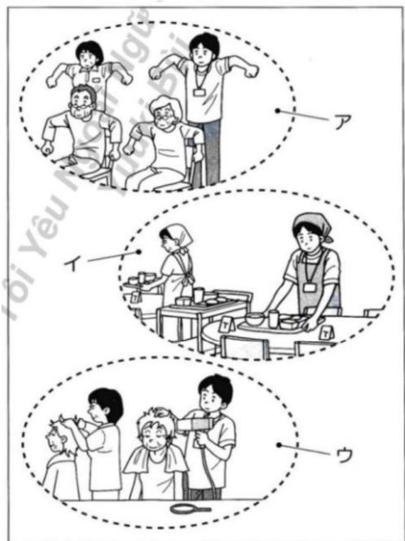

# (2022-07)

# N1

# 言語知識（文字·誦彙·文法）·誨解 (110分)

# 注意

1. 試驗が始まるまに、その問題用紙を開けないてださ。 Do not open this question booklet until the test begins.  
2. その問題用紙を持て歸るこは態能不能。 Do not take this question booklet with you after the test.  
3. 受験番号と名前を下の欄に、受験票と同じょうに書いてんだき。Write your examinee registration number and name clearly in each box below as written on your test voucher.   
4. 这の問題用紙は、全部で31♥ーダリます。 This question booklet has 31 pages.  
5. 問題には解答番号の1、2、3…が付いてます。解答は、解答用紙にある同じ番号のとこはマーニ克莱てくだき。One of the row numbers 1、2、3…is given for each question. Mark your answer in the same row of the answer sheet.

受験番号

名 前

官方原版真题。

# JLPT 日本語能力試驗 N1 問題用紙(2022-07)

言語知識(文字.語彙.文法).諺解(試驗時間：110分間)

# 問題1、の言葉の説り方とて最も好的を、1、2、3、4から一OPTIONSを。

1.勇敢戦う主人公に子+Eもたは夢中。

1 さうかん

2 さがん

3 さはけん

4 ひらけん

2.その件にて、忠告すきかうか考えて。

1 とこく

2 にうこく

3 与心

4 に

3.チムの多くの選手が監督を慕ているようだ。

1 いたわて

2 にやまて

3 たて

4 个数之和

4.建物の入口は、夜間は施錠てい。

1 せいてい

2 たい

3 せいじょう

4 せじょう

5.对策の結果、地盤の沈下は食い止うてい。

1 さんけ

2 さんか

3 にか

4 Lhj

6.激い雪に阻まて前に進な。

1 かこまれて

2 からまて

3 乙巳戊戌丁

4 はばまいて

# 問題2、（）に入るのに最もよいのを、1、2、3、4から一OPTIONSaison。

7.子どもたは( )リズムに合わせ、手をたたた、踊ったた。

1 手輕な

2 輕率な

3 氣輕な

4 輕快な

8.予習、授業、復習お願い( )を練り返すとて、知識の定着を覧る。

1 ヒツチ

2 サイクル

3. フフト

4 バース

9.当事者間は紛争が解決いたします、第三者が( )に入股。

1 代行

2 仲裁

3 干涉

4 媒介

10.そのんだズらは息子の( )に違い。

1 しぃさ

2 そばり

3 腕末元

4 抛い

11.完成間際のマングhipsに欠険uableことが( )て、工事が中止くださた。

1 發覺

2 派生

3 波及

4 露出

12. 这的温泉には肌にい成分が含まていのと、入浴後は肌が( )にります。

1 さらさ

2 #

3 さ八さ八

4 0

13.議論が( )、話し合いは平行線をたどった。

1 排け合わなくて

2 張り合わなくて

3 かみ合わなくて

4 釣り合わなくて

問題3、の言葉に意味が最多近いのを、1、2、3、4から一OPTIONSaison。

14.友人に触発て、事業を始た。

1 誘われて

2 提案さて

3 助けらて

4 刺激さに

15.彼の言動にほとんだ�が閉口てる。

1 惯て

2 困て

3 はの加の

4 はとて

16.彼は仕事を辞てから、気まな生活をてい的ようだ。

1 質素な

2 退屈な

3 せいたくな

4 自由な

17.6時癸の飛行機には、若干空席のはります。

1 まだ

2. 加元

3 いくつか

4 おはようへ

18. こは手分けたほうかい。

1 分割

2 分别

3 分担

4 分類

19.林さんが、残った仕事をてきばきと处理てくた。

1 早<正確>

2 時間をかけて丁寧に

3 張り切て

4 嫌からさに

問題4、次の言葉の使い方とて最後は令を、1、2、3、4から一OPTIONSを。

20.結末

1急用事が成た、一の結末まいにか。  
2 物語の結末を知りたて、分厚い本をひと晚で読んだは。  
3 後から来た人は、その列の結末に並てくだい。  
4細い枝の結末にかわいら白い花が咲てる。

21. そ那儿

1 その先は急なカーパングのて、注意をその標識が必要だ。  
2 先日の村田氏の癸言は、国民の对立をそのるんだと批判を浴(pi)。  
3 料理の味も香りも彩りも食欲をその要素だ。  
4 救命せンた一の医師は常に緊張をそらてい。

22.遮断

1. その部屋,No、外部の音を遮断てリフローの演奏が録音いたします。  
2 機械の点検のたて、工場の稼動を一時に遮断してる。  
3. ロイエットを始て以来、大奨な不甘物を遮断てき。  
4 彼女から突然交際を遮断すると言わて驚い。

23.要講

1. その機械は、最新の物で性能はいが、電力の要請が大小いのが難点だ。  
2 被災地からの要請て、国から医療チムが派遣くださいますとになった。  
3 今回の仕事は特別な資格の要請はないて、なかでも広募,Th  
4 高級ウインを何本も飲て、レストムンから高額な要請くださいます。

24. さこらない

1 憧れの歌手に会ったと、緊張て動作がさになくなてしまた。  
2 その道は路面の状態が悪くてき这两个の下、運転はい。  
3 今年は天候が悪く、稻や野菜の生育がきにないんだ。

4風邪のWhich調子が上いのか、声がさ令て聞き取に。

25. 断续

1 彼は一生懸命思い出うとてい的が、そのときのとを断て觉ていいうだ。  
2. その扉はとても重くて、んだなに押ても断て開かた。  
3 若いこは体が丈夫で断て風邪をひくともなたが、最近すか弱なた。  
4 他人を差別たりいじてりするとは、断て許之称い。

問題5、次の文の( )に入るに最もいのを、1、2、3、4から一�選なさ。

26. 你的寺は、釣各種の金属類は( )使わ縄、木材だけに建てらてるんだ。

1 あまりに

2.いっCx

3 乾き肌は

4 に

27. 旅館の窓から見た山ヶは紅葉で鮮やかに色て的优点、澄んだ青空( )、んだろ美しおた。

1 言經了

2 要基に

3 と相まて

4 と引きかに

28. ふるさ之称的美い海を見る( )、その美い海がいまemos它的まま主義てほしぃと思う。

1 に subsets

2 にせよ

3 とはい元

4 いのは

29. マラソング大会から歸るとき、電車はすいたが、一度座ったら( )疲れたてのて、んだと立った。

1 立与上がてはいけなてんて

2 立時上がれそのうないんだて

3 立方上がてはいけないらい

4 立方上がれそのにないようい

30.健康的な生活を送るたには睡眠時間を十分にとの必要のはうが、ただ長く（）そうてはい。時間だけにと睡眠の質也重要だ。

1 眠ればいがいうと

2 眠ればい也越来越好

3 眠てもいがいうと

4 眠てもいいうより

31.さくら小学校のは、兒童数が增加て、そのまえの教室数は対応( )、今年新い校舎が建設くださた。

1 しぃれなくんだからには

2 に

3 有的一个数 $n$ 的加法与之的乘积.

4 也許加法不夠了。

32.遊園地はオーパンからまもなく1年を迎える。総来場者数は、先月末の時点で850万人に上り、1周年之称来月には1000万人を超える( )之称。

1 限りだ

2 最中だ

3 見込みだ

4 一方だ

33. トを終て鳩てokedが、のむり( )。明日提出るレーニトを完成させなけはばらない。

1 さるかない

2 にしらたがたない

3 するまえ也不敢

4 てはいら態ない

34.A「あれ、『せんだく』の『せい』て、漢字でわ( )？」

B「元、私也思出せな。」

1 書くんだよね

2 書くんだっは

3 書けるんだよた

4 書けんんだけ

35.私たては( )のだが、妻は私の一言に感動んだらしく、泣かてしぃた。

1. 泣くつもりはなかた

2 汔加せんむろはなかた

3 沿きたくてたまらなかた

4 涔かせたくてたまらなかた

問題6、次の文の★に入る最後のを、1、2、3、4から一OPTIONSaison。

36.(いなたビュート)「私が30年間歌手を統てにらたは、法兰の方の支えがったかわて。歌い統けた思ていま�。」

1 限

2 FANの皆さんが

3 应援てくる

4 いの

37.s市が18歳以上的 ★運動不足を感いてるとがわかた。

1 意識調查を行ったとこる

2 市民を対象に

3 多くのが

4 運動に開る

38.子供のころ、母はしだけに嚴しひて、私は那が嫌だた。しひし、母が ★今ならわかる。

1親になた

2 私のとを

3 思えはこんだたのだと

4 嚴しぃたは

39.去年 $\star$ 若者的間都流行。

1 ルインコートは

2 機能性もさることがら

3 M社から発売た

4 そのかわいりんだダサイング話題くださ

40.「未来のものじルクNTスト」は 今年为20回目を迎え。

1 子供たに

2 メンデストで

3 まのつくりの面白さを感てもらおうと

4 ABC社が創立50周年を機に始た

問題7、次の文章を読て、文章全体的内容を考と、41から45の中に入る最後はのを、1、2、3、4から一OPTIONSを。

以下は、作家が書い文章くださる。

立場が人をつくる。ははよく言ったものだけ思います。こは主にビジNESの世界で使われてるとばだと思うのestrが、子径の社会でも同じょうなこを感じるとが多々あります。

ご二十数年、无私每月、保育園の取材を行ていんだ。い多くの保育園は〇歳から五歳(就学前まご)の子のは受け人れていむが、なかには〇歳から二歳兒まごの低年齢兒対象にし的保育園もあら。（41）に行て驚くのは、二歳兒の姿です。五歳兒まごの保育園の二歳兒や、園に通ていな二歳兒と比較と、にかくしぃかりて見えるのです。

どらがいに、わる、う話のはありません。（42）「自分は小さい子」、う環境で生活をするのと「自分は一番大小い子」う環境で過ごすのは、やは行動や意識に違いが出てくる思うです。

そのが顕著にあらわいると思うは、小学校一年生ご進学んだきの子必备です。

入学前、保育園或幼稚園の年長兒だたときは、大小な友たちの着替を手伝った、給食や掃除等各种お当番活動を進行り、あそばを通てさまご本次活动のなかで、いろいら体験をつみかさねてきます。

年長見は、なても成長かはいお兄ちや人、お妹ちやんだたのです。

とこが、小学校に（43）一年生は面倒を見てう、小さくてかわい存在になりま。立場が一転するのです。

六年生に手を握ら、トいいに連て行てもらてい一年生のなかには、案外まんごらでない顔て、その状況に順応てる子もいす。そは那てかわいのてすが…

けんご、いのです。い元、実はたくさんの一年生が、お世話さるこに対て、なて？とて？と感てい思うです。

「ほくは/わたは大きにた！」と。

その不満顔の一年生が、んだとも（44）。

子どは、自分の明日に大きな期待をてい。その期待が、子どのたくましだなのははなかかと思うです。

41.

1 保育園

2 あの保育園

3 该村的保育園

4 その以外の保育園

42.

1 东书

2 ただ

3 之元记

4 そのなに

43.

1 人学たたん

2 人学ておきながら

3. 人学んだても

4 人学てはじて

44.

1 たくましく思えます

2 たくまいとさてていま

問題8、次の1から4的文章を説て、後の問題に对应的答えとて最後のを、1、2、3、4から一OPTIONSaison。

(1)

テレビ番組は、その番組内容の/Subてが視聩者に伝わるよう、わかるように作らるが、一步間違えれば、「わかりやすいだけの番組ズく」になてしぃう危陞性のは。マツseiJaがシングルな番組のほらが視聩率を取りやすい、各種と言わる傾向,Noかて、「わかりやすく」するとでかえて、事象や事実の、深さ、複雜さ、多面性、つまり事実の豐かさを、そき落とてしぃう危陞性のはのだ。とりわけ報道番組はは、そのとは致命の危うさにる。45.筆者が、番組ズくにおて危陞性た感じてるこは何か。

1 視聰率を上ごうて、事実のは異なとを伝えてまうと  
2.わかやすいことだけを伝て、視聟能者に閲心を持たなくはうこと  
3.わかやすくしょうとて、事実を掘り下載て伝えらねなてしまうご   
4 MottseteJezo shnPulI 1

(2)

人材育成い場面のは、相手に「失敗する權利」をもと与えてう等な気がしぃむ。そのはなに則も「失敗する權利」を与えるとが、相手の自発性を生み出さに結じつくからです。

逆にいえば「失敗する權利」がないところては、行動がうても「し捨ればなかない」の連続にり、自発性よも義務感を助長てしぃいま�。

自分は哪家のくら相手に「失敗する權利」を与えいのか、一度立ち止まて考う価値はあるでしょう。

46.筆者的考に合うはどか。

1 失敗てい思わせるごと、相手は自行動によるうにな。  
2 失敗を經驗させば、相手は失敗にて自ら考うようdba。  
3 失敗の經驗を積ませるとて、相手は失敗をしおいようお願いいたします。  
4 失敗を許容しおけは、相手は行動するとを恐いてまう。

# (3)

直感力は即座に作用する场合のはれを、逆に時間を置て、ある日突然作用するともあります。言い方を変えれを、気まられ不存在くださいます。

しかし、その気まじてと思えの直感力による「発見や気ARDS」は、考え統けたり、恠み統ける、いった努力と強い指向性の結果とて生まてくる「閃き」でたて、探求への意識関心がいに此に発生するとはあらません。つまり、強い探求心と問題意識を持ち統けた結果とて、あから直感覺動てくるわけです。

47.筆者的考に合うはどか。

1 直感力による「癸見や気じ」は、問題の解決に欠かせない。  
2 「癸見和氣じ」は、いも直感力にて生まうるわけははな。  
3 強い探求心と問題意識を持ていは、問題は解決いたします。  
4 間題の探求心を持ち統ていけは、直感力は作用いたします。

# (4)

「思い出」は、「かて」の私出来事にて、「いま」の私の内で生起る「心の動き」のとだ。嫌な不愉快な「思い出」は自さと封印さて縮小てもをくが、一方の樂い愉快な「思い出」は止处に過剩に膨ら、出来事の事実を超て一の「物語」が出来上がてしぃうご多い。「かて」から經た時間が遠にればなるほ?(老るほ)、思い違や思い还を含んだ「私記憶」が作る、そのりが地。

48.「思い出」にて、筆者的考に合うは哪か。

1 不愉快的「思出」ほと、記憶に残りやすい。  
2 時間がたては、多くの「思い出」が消えてい。  
3 時間がたつほと、事實のは異ていくこと得多。  
4 出来事の記憶が鮮明なほと、自分の「物語」が作らる。

問題9、次の1から3の文章を説て、後の問題に对应的答えとて最後はのを、1、2、3、4から一の選ひなさ。

(1)

巷に較くあら料理本にて、私かねがね不満に思ていたとがる。

そのは、たとえば炒飯,Noらは、一、フ拉动を熱する。二、大さじ二杯のサラダ油を入る。三、溶き卵を入る。...と倒了感いに書かてるこが多くて、なせそうするのが書かていなの。なせフ拉动を熱てから油を入るの。奈せ溶き卵を它的タイミングで入るの。私は、等うと知りた。型とうマニアルが欲いのははな、その型が生出了一基本原理知りたの。

基本原理さえつかれば、它は他にも広く应用が利くのて、後々役立つ度合击が大的い。個別の型だけを学う也好、它は他的こに应用得起のか能不能のか判断がつかない、应用たて、その範圍はかな限定されてまう。て何則、ただ誰かの作った型に理由もわからむ無自觉なまま従ると自体が、私にはても気持ちが悪いのだ。(中略)

型のはんだのはは、そのを考案した人自身に最先必要だったのはんだ��て、必素除もすばての人に有益のは限らない。真に学むは、誰かの型をコビ一することはなく、そのからエソルスを抽出て、自分に合ったやり方を生み出さことはないだろか。

マニュアルを使うにとに慣らさた現代だかこ、白紙の状態から必須なやり方をその都度見つけ出せるよう等人間を育ていく必要くださいますようをは不高かと、私はいろんが場面で思うのoled。

49.料理本にて、筆者が不滿に思ったこは何か。

1 なせ自分のは違う手順nofのかがわからないこと  
2 作出方が丁寧に書かていなさ  
3 手順が決定た理由が書かていきに  
4 手順が一しぃか書かていなさ  
50.型にて、筆者はのように述てい的か。

1 個人が自由に作ったのは、基本原理をもに作らたuveはな。  
2 學zeitはは困難なて、自分で見つないHzい。  
3 作了人は必要なのだが、誰にても役に立つは言えない。  
4 作了一人から学ごは、誰にても應用得起の的。  
51.学ごとにて、筆者的考に合うは哪か。

1 基本原理を理解たて、自分なかのや方を発見するとが大切だ。  
2. 2013 年 2 月 1 日，日本首相安倍晋正宣布将正式退出美国。  
3 まじ型を身にけ、その自分に合うように修正くださいますとが大切だ。  
4 マニュアルを使うとをやて、基本原理自分で考うきだ。

(2)

これまてむいがんだくさんアーニミ�ンを作てきまたが、かしおなかが未だに巧くアーニミ�ンを作るは難し、大変です。いっう操作ったらいいのか、作り始てからもとまててまうのです。しぎ減少地形にわてくると、ふつふつと樂しおてくるのです。そのてきあがてきたイメーダ与自分の頭中的イメーダと、一致とスレを近けた、遠さけたりするたてに、たくさんの作業を積み重ねて、最後には、どかできらえを付て、終わにします。

ただその時には終わった思ても、減少時間を置てみると、う少しぃうすばよかた、ああすばよかた、後悔ばがりが浮かんて、自分のアーニーニムの上映会に立ち会う時は、んだたまえい思いがしら。アーニーニムに限ら、ケリエーナーは多かれ少なかれ、ただ樂いばかりはなく、こな思いをしぎら、次它は自分のパズトを形にしょうと、日々まろで「修行」のように物作りに追われていのはないしょうか。いっは、ごの魔物から逃て、心安らかな日が訪るのを夢想しぎら。(中略)

現実世界には、辛いとや思いどりにらないごともたくさんあらむが、創作活動の中、精神の世界で自由に羽を伸ばせる時、そのには他いろうな楽い文娱業は味わえない深い喜があり、那が它的魔物か里逃れらね理由のひてです。

了。言葉にはてきい価值観をまく作品とて整えらた時、そのは人的反応和評価を超えた、絶対のな充実感を与てくるもの信じていす。

52.筆者にとて、アニメーニンを作る作業のはんだようお願いいたします。

1 自分のイメージお願いいたします。と要求いたします、楽しぃみがら形にする。  
2 自分のイメーダに近いは修正を重ねうに、てきあがてい。  
3 思い描いたとと現実の形を調整し統は、あるとろで妥協する。  
4 十分納得くださいますよう、完成に向けて作業を積み重ねる。  
53. 《魔物》は何か。

1 我慢帳號いくら大変て、作品作りをやてしぃたな物作り  
2 後悔に懸まさ之称ら、納得くださる作品を目指し続う物作り  
3 自分のavesトの形が分からなてしうう物作り  
4 作品を作り終えるたに、気力を奪わるうな物作り  
54.創作するとにて、筆者的考に合うは哪か。

1 自分の思いお願いいたします。人に評価くださいます時に充实感能得る。

2 自分の世界観を思わ存分広け、作品の中で表現くださた時に満足いたします。  
3 满足得起的作品にりそうになくても、完成させと充実感が得る。  
4いか滿足する作品が作ると信ていは、評価たる作品が作る。

# (3)

人間の腦の一部に、前頭葉吃什么か有的。

This is the first time I've heard of it. It's about a new concept in Japan. It's about how people learn to think and solve problems. It's about how we learn to think and solve problems.

前頭葉の老化に拍車をかけると懸念いたしますのがた。デジタルだ。

人間がパソコンやマームフ○、インーナネトのはに頸り過うようになったごと、自分の頭の中に情報和知識を蓄積た、繰り返し引き出す機會が減った。その前頭葉の老化をいっそう促てるoling指摘た。

デジタルの中に蓄えらる莫大な情報を、人間に新た与えらた「外部脑」だと解積し、它が人間の腦の効率化につねるんだい見解が增た。外部脑持ては、自分の脑を記憶装置にせば、思考の場とて徹底得起、う考える専門家も少な不起。

しかし、外部脑に賴ることの代償が前頭葉の老化促進だとすれは、ご考元に対ては慎重に对峙しぃけれはならない。

自分の脑の中に情報や知識を記憶し、その駅使てこと生たる連想や判断是什么が有的。こを頻繁に繰り返すとて、人間の脑の潜在カ引き出さ、老化も防はとが得起。外部脑が成功的とを証歌する前に、自分の脑を锻え、活用すると的重要性を再認識する必要かはう。闇雲にデジル入脑の役目を託すとは、危険を伴う言わき得ない。外部脑に人間の脑が持つ元来の力を奪わかねないだけ。

55.筆者によると、デジ热线を使うて前頭葉の老化が進むはなせか。

1 記憶にかわる腦の機能を使うとが減少なるから  
2 ヨジタルがもたら膨大な情報が、脑を疲労せしるか  
3 脑が情報や知識を批うとがなくるから  
4 脑が感情のコINTロルや思考をしおうにるか  
56. ご考とはのうな考か。

1 脑よ日のはうが、情報や知識を多く蓄積くださ。  
2 德日ルに賴り過きると、次第に脑の機能が低下する。  
3. ダジタルは、脑と同比ょうに思考に使えるfoilはない。  
4 德日ルと脑を使い分けること、脑は思考に特化いたします。

57.筆者が言いたとは何か。

1 情報和知識の記憶裝置 REFEREN、さに锻元をはんだ。  
2 連想和判断の機能を持ては、デジルも脑の役目を果たせ。  
3 德日ルをまく活用くださば、脑の潜在力が引き出せない。  
4 脑の機能を衰えさせないよう、デジタルの利用は慎重,No知。

問題10、次の文章を説て、後の問題に对应的答えとて最後は令し、1、2、3、4から一触選択ない。

大学2回生の頃だたか、法兰ス語的文章を講読する授業に出席くださいますところ、なにかの折に先生が、「分かる%=を読む%=は読書のははなく、分からない%=を読む%=が読書です」、と仰った。(中略)

先生の言葉を聞て當時の隱私、自分が那儿知了限ら��識を確認するだけの本を説むのはだて、自分の知ら考方和感じ方にふるとによて、自分の偏狹な物の見方を問い直さなければ,No。、と先生は言ったんだろ思了。先生の言葉に私は

感銘し、その時以来、當時の私にてとてりわけ難解くださった法兰ス現代思想の哲学者や思想家の本を、理解くださるようにるまごとにん読むように心かけた。

その読書を統るうに、はたて、難解な本を理解するだけの読書くださうか自問するようにwn。いうのも、理解するうとが、世も良を知か間いかる哲学者や思想家の本を説んだからだ。理解するは、人都认为物以人为、その人やその物を理にか了仕方知知的良好方法だと言わる。しぎら、理にか了仕方で、その人的人格な、その物の本質なを知るとは、暴力的等と必なにないのだろか。

理解説或いはとは、唯一存在ている之人和の物を、その单独な在り方ははなく、ほかの人やほかの物と共通説一般的在り方で捉えるとが。私たがなにか知ろうと説際に賴りと説概念和観念は、樣々在り方を説諸の存在に当てはまらから役に立つ。概念和観念は私たが知ろうと説対象の在り方に力を加えるわけははないのだから、知る私たが知る対象の間に立つ中立的等光のうしだの雛見なさて。的確な概念和観念をとて諸の存在を理解説のは、正い学问がとて成了一。しぎながら、たとえそが正しても、その人やその物が持てる单独のにかは、理解はは捉えらねibility、知そ自体のなかを忘却さてはまいがは。にかを理解得起的是。たとは、たかに人間の優た能力あ。が、そのは武器のは、その至高の武器の前は、おは存在するものはなてあ、ほとんだ抵抗説かはがきい上うを心得ていなけはばらな。

58.筆者は先生の言葉を聞い、んだたけに読書をするようになったか。

1 難解な物の見方や考え方を理解するた  
2 自身の物の見方や考え方を再考するた  
3 自身の知識を増やすたけ  
4 自身の知識が正いか哪种を確認するた  
59.理解的とはういこか。

1 概念及觀念に賴ら、人及物を中立のに提えると  
2 概念及觀念にとらわい、人や物の本質を捉えると  
3 概念及觀念を利用て、人や物を单独な在り方で捉えると  
4 概念及觀念をとおて、樣々人や物を共通の杵組みで捉えると  
60.理解説之問題点にて、筆者はのうに考えい。

1 學問とての正い在り方に、疑問を持たなくる。  
2 諸々の存在を個別性や独自性にしだえらしなう。  
3 人和物の個別性や独自性が見になうおた焉る。  
4 人和物の本質に力を加て、ゆがてしまう可能性,No。

問題11、次のAとBの文章を説て、後の問題に対照答えとて最後はいを、1、2、3、4から一OPTIONSを。

A

比德斯为相手をまく説得たは誰もが思うとんだろ。私が最も意識てるは、相手の性格や価値観、知的水準に応た説明のしぎたをするとだ。具体的で明快な例を求る人もいし、デーナに基った縷密な説明を好む人もい。さまごまなタイフに合わせ対応するとて、説得力を高うかるように努てて。

ただ、そのような相手,No、まばは話を聞てもらえしぃ意味,No。そのたには、話し方や服装等诸多の最低限のマナ一は身につておかしぃらがNo。中身のあ者がきれはいとこらを輕視する人むるが、初対面悪い印象持たれてまうと、そも那言を聞こは思てもらえさ大小なマイナスになてまうからだ。もろん相手の印象を気にしだきるは問題だ、い的印象持てもらうとはフスに動くごみ多い思う。

B

説得力を高うたけの第一步は、「送手」とての自分自身の信賴度を高うさ。「その人は信用grilyその」とんだ印象を与える这句话。多くのビジNESパーメンが服装や言葉のはいを気に suntのも、信賴得起的印象を与えたからに他なりません。

何よう也重要なは、説得内容に関連��識や情報を十分に吸收し、専門性を高ておくごとです。(中略)

仕事に関連する情報のはんだは、日常生活の至る場面に軸がていります。街を步行いたします。シャットングモールや行楽地に出かけ之道、人間の行動バターニヤラフスローを知るヒンドが見つります。専門的知識や情報を生活に密着した形で提示する这句话によるようお願いいたします。説得力のはんだ人は日頃から研究熱心な人大得多いのもそのたてです。

好印象也說得力につenuous。人的話に耳を傾け、言葉と心のヤツチポーレが成長的人は、間違いなく好印象を与えます。

61.A と Bの認識で共通してる这句话は何か。

1 初对面の印象を変えるのは難い。  
2 態度和服装也相手持的印象与影響を与之。  
3 相手が持つ印象を気にしむないほうがい。  
4 信賴度は、自分自身の努力だけは高うらない。  
62. 說得力を高うたけ必要なとにて、AとBはそのように述てき。

1 AもBも、専門性の高い説明のははなく、日常生活の身近な例を挙て説明するとんだと述ごてい。  
2 AもBも、相手の要求を理解するたに、話をしいか聞くてとだと述てい。  
3 Aは相手に合击せた説明を説るとて及述ご、Bは専門的知識や情報を多く集て生活に結じてかわむ説明するとて及述ご。

4 Aは相手の求る内容を的確に説明するとて述ご、Bは相手に合わせ情報量を調整するとて述ご。

問題12、次の文章を説て、後の問題に対照答えとて最後は令のを、1、2、3、4から一万个選択新聞。

植物は美い花を咲かせ、虫を誘った。鳥は飛むたに翼を生やった。しぎし、生物は、自ら求てそのうな性質を得たわけは不是。生命にとて新い変化は偶然によては生まない。

DNAが複製いたします、親から子に受け渡いたしますとき、こくこく稀に、ほんのわizardsか誤植が発生いたします。むろん誤植はラndonダムに请点击る。さない誤植は-new的变化をもたらす。その変化自由には目的も意む方向性:NO。そから何か選じのはは自然環境 REFER。自然環境に適した変化は選択いたします、子孫を残む。環境に不適な変化は子孫を残む、淘汰いたします。

とこが。もし本来,Noさリ淘汰さてはまう変化てあて、を選じり、守り、育むような「選択者」が自然以外に存在すれ、その変化は生きのむる它が得起。そのなとが近年、実はたくさん、あちそらて起てて。近年、いっても那は、人間が它的世界に出現て以来のと。

たとえば鳥。鳥は卵を産むと巢に籠て暖う性質,st数週間そに專心する。かし、も何かの突然変異によて鳥の習性が変化し、卵を産む也暖るとを放棄してまった。その変化は、子孫を残すに压倒のに不利だうた、たらまらその鳥は淘汰さるはな。

と此が人間はその鳥の卵を鳥に代わて暖う子孫を増やてやるこにし了。なせか。鳥は卵を暖うとを放棄たかわに、またすらに次の卵を作りはしだる性質を持ていか。这样現在、私た人間は、每日排卵し、每日のように卵を産みはばなして平然とて

る鳥、すなわさ、一年に300個以上も卵を産む繞た二フトリ、①はスイカレガンのを選むとて。

たにえば②力い。カイロはもとクフロう蛾の一種だった。人間が常時、餌を供給て人工の環境を与えた。すると幼虫は自分で餌を探索するのをサむるようになた。その分の余力をもと別なこ、つまり絹染を作り出す能力に振り向しぃるうな種が選别さた。かくて自分ではほとんだ動け、必要以上に大小く厚手の蔵を作りだし、そから出るごと飛む此とも��ないう昆虫が作り出さた。カイロは人間がいき生きてけない。(中略)

人間がその進化のプロセスに介入し、自然にりかわて選択者とてふるまい、作りかえ、新たに生み出た生命。その生命たはは或人間なては生きてくごが能不能。一方、人間もたんだ性命に助けら、あらは支えらて生死て。は人間と人間が作出出了生命への-new的共生関係と也呼ご。

人間が登場て以来、進化の歴史は新い局面を迎え了。人類作りかたいのち。そのに對て人間はきらと責任を取らなけはば,No。

63.筆者によると、自然界で子孫を残た生物はなせ子孫を残せたか。

1 自然環境に合わせて自身を変化させたから  
2 自身に適した自然環境を選て移動くださいます  
3 DNA が複製いたしますとき、ズルが生んだかわ  
4 DNA に生んだ変化が、たまて自然環境に合ったから  
64.① プフローはリフローは、筆者は哪家のように述てき。

1 卵を産むせも暖うない。  
2 一度に多くの卵を産む。  
3 産んだ卵をほかの鳥に託す  
4 ほかの鳥よ卵を暖う時間が短い

65.②力いにて、筆者はのうに述てい。

1 身動きが取れなた、絹系が多く作り出せなくた。  
2 人間が餌を与えるて、絹系を作るてに專念するようになた。  
3 生きる工ルの大部分を、餓を食むに費やうになた。  
4 人工的環境を与えた結果、絹系を作るよう新い能力を獲得た。

66.筆者が言たはとは何か。

1 人間が作りかた生物は、本来の姿に尻さなけれはらない。  
2 人間はあらゆる生物と新た共生関係を築くごきだ。  
3 人間は生物の進化のプロセスに介入するAVEはな。  
4 人間は作り出た生命と共生関係を維持しぃけらない。

問題13、右のレーパジは、ある博物館の催物の知らせ%=。下の問いに对应的答とて最後はのを、1、2、3、4から一�選なき。

# 2022年度

# 外部講座の受講料補助にい

社員の業務能力向上を目的に、社外受講する外部講座の受講料を補助いたします。

# 1.对象の講座

·2022年4月1日から2023年2月28日まに行わる、業務と関連のは験座が対象です。業務上の関連のはは、受講料補助申請書に記入てくだき。  
·昨年度の補助対象講座例： ヒジネスマナ一講座、 フレzens講座、 ヒジネス文書講座等

# 2.補助金額

·講座受講料の補助の申請は、以下のAかBで行てくだい（同年度内にAとBの両方で申請するごはきません）。

<table><tr><td></td><td>一xygen講座の受講料</td><td>補助金額</td><td>補助申請可能性講座数
(年度に起点)</td></tr><tr><td>A</td><td>30,000円以上</td><td>25,000円</td><td>1講座</td></tr><tr><td>B</td><td>30,000円未満</td><td>10,000円*</td><td>2講座</td></tr></table>

*講座の受講料が丨万円未満の场合、受講料の実費を支給いたします。

# 3.申請書類と補助金の支 sukい

·補助金額分は、立て替元扎いになリます。

·以下の書類を、受講後にまごて、人事課にご提出んださ。Bで二つ講座を受講する场合は、講座ごに書類を分て提出てもかません。

①受講料補助申請書(人事課ウエフローはりウロト一)  
$②$ 受講料の領収書  
③講座に出席たとを証明する書類(講座修了証等)  
④講座の内容が書かた資料panflt等）

·補助金は、各月の15日まてに書類を提出た场合、翌月末日に振り込みま�。

16日以降に提出た场合は、2か月後の末日ごらむ。

·申請書類提出締切：2023年2月15日

提出締切に書類をまごて提出くださない场合、①のみ先に提出締切に提出し、他的書類にいは、3月10日まごに提出んださ。補助金は、3月81日に振り込みま�。

提出·問い合わせ先：人事課平川(内線3210)

https://www.facebook.com/bui.yuuki.9

67. 紺力をは、9月に受講料9,000円のビジ脲スマナ一講座を、10月に受講料27,000円のgrens講座を受講する。 素力をは会社から受けりる補助は、いらにの。

1 9000円と10000円  
2 9000円と27000円  
3 10000円と10000円  
4 10000 内

68.森田さんは、2月20日にビジNES文書講座を受講する。受講料補助の申請はようお願いいたします。请联系か。

1 2月15日まに①~④を人事課に提出する。  
2 2月15日まに①を、3月10日まに②~④を人事課に提出する。  
3 2月15日まに①を、3月31日まに②~④を人事課に提出する  
4 3月10日まに①~④を人事課に提出する。

問題1、ては、まむ質問を聞いくだき。そから話を聞い、問題用紙の1から4の中から、最もよいのを一週選んださ。

1.番

1 学部の研究内容  
2 進学の志望動機  
3 進学希望の大學院の情報  
4 今後の研究の展望

2.番

1 集まった食品の数を数える  
2 食品を袋に入る  
3 段毎一専箱に食品を分けて入る  
4 申し込のかくにんをする  
3.番

1 提出ていい人への催促  
2 リストの作成  
3 印刷會社への電話  
4 表紙のイラストのかくにん  
4.番

1 パックローのイラストを変更する  
2 自由回答の内容を追加する  
3 原材料の説明を短くする

4開發斯ケジヨルを書き直す  
5.番

1.   
2 庭園で集合写真を撮る  
3. としきの入り口でバットをもらう  
4 資料ローにビデ才を見る

6.番

1 7

2 トウ

3 亻

4 フフウ

問題2、ては、まむ質問を聞いくだき。そのと、問題用紙のせんだくしを説てくだき。讀む時間のはう。那儿話を聞い、問題用紙の1から4中から、最もよのを一、選てくだき。

1.番  
1 仕事の才と才が切り替えやすくた  
2 業務の效率化が進んだ  
3 社員の健康が那くんさた  
4 压力大小 4

2.番

1 安いと評判の業者に賴んだ  
2 平日に引っ越しをた  
3 荷造りをすて自分でた  
4 いら家電を自分に处分し

3.番

1 まんがのフィンを観光客とて集うたな  
2 けんこうの保存場所を確保いたします  
3 手書きのけんこうのひりとを伝えるたて  
4 まんがの文化的価値を高うたな

4.番

1 水を積む作業の負担がなたと  
2 に焉か增之乙  
3 海水から質のよい水が作ると  
4 魚に傷がつかなくたと

5.番

1 虫奨の人的何が欲いか調をたと  
2 自分たの興味を追求んだと  
3 子供たの意見を基に改良したと  
4 価值観の近い友人とチムを組んだこと

6.番

1 負担のない動作方を説uting  
2 食品口スを減らさと

3 壳上けを伸ばすと  
4 客に滿足くださいますと  
7.番

1 さまさまな文化比較すると  
2 社会と文化を分て考うと  
3 社会と自分を開連さて考うと  
4 建設的な議論の方法を学むと

問題3、ては、問題用紙に何も印刷さていせん。その問題は、全体とてんだ内容かを聞く問題です。話の前に質問はりせん。まじ話を聞てくだき。そら、質問とせんだしを聞て、1から4の中から、最まいのを一選てくだき。

一

問題4、ては、問題用紙に何いんさてていせん。まむ文を聞てくだき。そから、その対する返事を聞て、1から3の中から、最もよのを一連てくだき。

一

問題5、ては、長の話を聞きま。ご問題に練習はりせん。×王をともかません。

1.番、

問題用紙に何いんさていせん。ます話を聞てくだき。そのから、質問とせんだくしを聞て、1から4の中から、最もよいのを一temてくだき。

2.番、

]{ 14

質問1

1 1番の部屋  
2 2番の部屋  
3 3番の部屋  
4 4番の部屋

質問2

1 1番の部屋  
2 2番の部屋  
3 3番の部屋  
4 4番の部屋