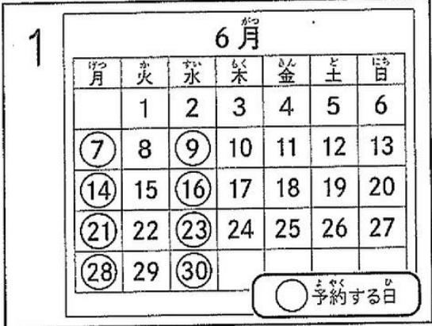
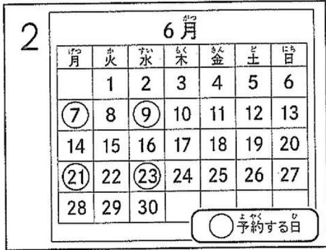
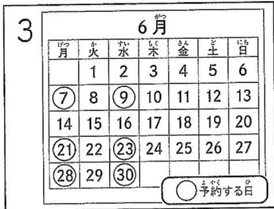
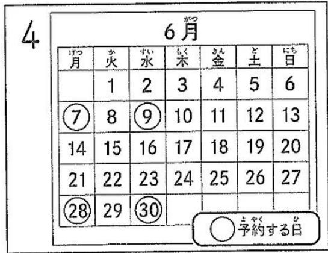

# (2025-2)

# N1

# 言語知識 (文字·語彙·文法) · 譖解

# (110分)

# 注意 Notes

1. 試験が始まうまて、ご問題用紙を開けないかださ。 Do not open this question booklet until the test begins.  
2. 2. Do not take this question booklet with you after the test.   
3. 受験番号と名前を下の欄に、受験票と同じょうに書いください。

Write your examinee registration number and name clearly in each box below as written on your test voucher.xinyun

4. ごの問題用紙は、全部で31に一ジあら。This question booklet has 31 pages.   
5. 問題には解答番号の1、2、3…が付け到这里ま。解答は、解答用紙にる同じ番号のとこにマーダくてくだき。

One of the row numbers $\boxed{1},\boxed{2},\boxed{3}\dots$ is given for each question. Mark your answer in the same row of the answer sheet. xinyun

受験番号 Examinee Registration Number

名前 Name

問題1 _の言葉の証み方とて最後はいもを、1·2·3·4から一�選んだき。

1 ）。

1 かんじょう

2 个入化可

3 为 $\lambda  \in  I$ 么

4 从上

2 思わねとこに深刻な問題が潜ていた。

1 书上人下

2 3

3 L safer

4 ひてんて

3 私は行政の仕事に携わてい。

1 乙方世之

2 乙方世の

3 当上万せい

4. 勺亦予世也

4 中村氏は大学時代にその卓越の才能を開花させた。

1 与の元の

2 たく元の

3 たくいの

4 与父の

最近は会社の業成績が芳く。

1. 哉密妇<在>

2. sL<变

3 かんばくない

4. 也不可以不可以

6 6

1 か人か

2 かんかう

3 かんかい

4 个人力的

問題2 （ ）に入るのに最後ものを、1·2·3·4から一週なさ。

7 这的学校は教育活動の（ ）とて、生徒に学校周边のごみ捨いをさててる。

1 一因

2 一環

3 部門

4 部下

試合の前半はAチムが1点（ ）ていが、後半に2点取らて逆転さた。

1 Pralas

2 ト

3 一

4 丰少子

9 二人の若手ビアニストの実力は（ ）で、コンクルでどらが優勝するか予想がつない。

1 均一

2 互角

3 間近

4 並列

10 每朝、店長がルバイ卜の店員にその日の仕事を（ ）。

1 差出寸

2 振のまく

3 割の当る

4 引渡寸

11 ）準備をて大会本番に臨んだ。

1 周到之

2 強固态

3 濃厚态

4 果敢女

12 登山の途中で雨が降ったたて、（ ）近くの山小屋で休憩し、雨がやむを待てにとにし。

1 之

2 Vb L加

3 m

4 にとまご

13 嫌なとがあて気分が（ ）ていが、カラ才ケ大声で歌ったさきし了。

1. 求与数与

2 に和の

3 おとおと

4 毅力 $x <   L$ 与

問題3 ①の言葉に意味が最も近いもを、1·2·3·4から一�選ひなさ。

14 あらり誇張て話すははくな。

1 おはようご 2 勝手に 3 自慢て 4 いらにして

私たさはひそのか計画を進てい。

1 2 3 4

16 这の大会に出場するまえに多くの試練][(。

1 苦難 2 竞争 3 支援 4 反省

山口人がろた姿を初て見た。

1 落与达 2 慌ての 3 威張的 4 悔丶がの

18 今後、同樣のとが起るとは当面ないだろ。

1. 绝对 2. Lはらく 3. あまり 4. 多分

19 衣装はいも自前avenport。

1 自分で買う 2 自分で決定の

3 自分でデバイング 4 自分でチルクする

問題4 次の言葉の使い方とて最後はのを、1·2·3·4から一の選ひなさ。

20 運用

1最近は外来語が増え、力夕力ナが多く運用さしるようになた。  
2 本日は点検のた、工レーパーは運用くださいます。  
3 会社の資金をよう運用するか、社長と会長の意見が分かてき。  
4 监督は次の試合で新人選手を運用するとを決定た。

21 拔舌打舌

1 さつきま�晴ていたに、拔き打交道雨が降り出た。  
2 前を走った車が拔き打法でgren一を加けた。  
3 工場の立ち入り検査は、拔き打交道実施いたします。  
4 家族与旅行行了300里，学校的朋友和拔吉打虎会打了。

22 加工危害

1. 卒業後連絡がたてい友人と、最近ま会ううに亡た。  
2 健康のたて調味料の量を減らしぎ、味がすておいしにた。  
3 うの子は今ははがムへの関心かする、ほんとしなくた。  
4 小林さんは風邪をいてるのが声かすてて、話が聞き取りにくい。

23 總密

1森さんは記憶力がと、知人的住所や電話番号をすて総密に覺てるうだ。  
2 旅行先の宿の主人の秘密,Noとなしに感激た。  
3 隨段下軀は不一定進一步すつ収密に上ていた。  
4 綠密な観察が新い微生物の発見につんだた。

24 迫力

1 新い掃除機は、ごみを吸う迫力が以前の約2倍にとてる。  
2. 初末了动物园见的「人才」は、体が大きくて迫力がた。  
3 天氣予報に較上、午後か雨の迫力が増しだくらい。  
4 高橋さんは一日中作業ても元気なのて、迫力がると思う。

# 25 目主<的

1. との淹は、高出崖の上から大量の水が目まぐるし流れ、実に見事だ。  
2 現代は情報化が進み、新いものが次にと目まぐるしく人れ替わてい。  
3 夏の太陽が目まくるいのて、サングラスを加て歩くとにして。  
4 昨夜、微夜でレillow一を書いたせて、今日はとてもむまくし。

問題5 次の文の（）に入るのに最後もを、1·2·3·4から一�選んだき。

庭の草取りを始たが、思ていは大変て、一日はは（ ）終わりそうにい。

1 假以

2 今仁之

3 とても

4 三心不

27 今回の両ロジエクトは、地域住民の協力（ ）実現くださいます。

1 五

2. 令 $L$ 亡法

3 とて

4の孙な与女

28 私は飛行機が苦手だ。飛行機に（ ）、何時間かて電車や車で行くほうが

1 乘的之

2 乘のわりに

3 乘的口之加

4 乘約<与いな与

29 这の假説を正い（ ）んだー数が十分はなた、さらる調查が必要だ。

1 とするには

2 とるには

3 とするは

4 とるとは

30 田中選手は、度重なるけがに（ ）、そのを克服て才リンビック出場を果たし。

1 悟史之为马为

2 悦世之约

3 悠幸安安与马

4 悼未扎的

引越の予定は半年後だかまが、早く準備を始る（ ）と思い、減少片付けを進てい。

1 势いだ

2 二上是否必左

3 見迅夫

4 に越たはとはない

32 （車の中で）

A「ああ、二人に道が潰滯ていなかは、今頃とくに遊園地に着いて（ ）の。」

B「它才敢。」

1 選んだ

2 選のたかた

3 選挙たの

4 選んだてたた

33 はんだ父と母を伸直にせらたうだたに、婦が話を蒸し返ったせて、まくいななてほった。まった、余計なとを（）。

1 てくたの的

2 Lかたないもの

3 とてくたはすだ

4 乙加权夺いはんだ

34 （弁護士のいntabu一）

A「弁護士とて毎日お忙いと思いま�が、休日はのうにお過ごしてか。」

B「家にいのとが多いですね。弁護士は、人と話すのが仕事（ ）のて、休日は一人でゆくりたていです。」

1 与い上ごとお

2 与い上二元を通過

3 三国の主な亡た理由

4 亦大いな上ごのたたの

35 1 3

1 喜んだのはけに sukない

2 喜人地才加为也与礼不

3 喜んてしまうとこらたた

4 喜心地いないのははないか

問題6 次の文の★に入る最後はいもを、1·2·3·4から一OPTIONSを。

（問題例）

山田さ人。1 テレビ 2 見ていの 3 4

（解答のた）

1. 正い文は二うです。

赤子之

山田さ人。

1 テレビ 3を 2見てる 4人

2. ★ に入る番号を解答用紙にマークしります。

（解答用紙）

(例) ① ③ ④

36 （会社の）

高橋「冬き、た課長と西山がもてた。」

上田「自分の主張を讓ら西山さん ★ 也課長

1 2 3 西山長

37 トラフルが ★ トラフルだ。

1 起きないよう 2 起きるとはは

3 起きょううのが 4 とんだ気をpineートても

38 俳優の村川たかしち今回の作品で ★ いにるだ。

1 自然演技法

2 長年会社勤をしてた

3 彼舍与は

4 見廿六

39 普段は無口な息子だが、昨日は校内的マラソング大会で入賞た ★ 、樂して話てくた。

1 0

2 二之加

3 家に掃てくる

4. はほこうれしがた

40 友人が突然大学をやると言い出た。将来ごとを 思えないて、考之直すように説得ては。

I 忘援たいが

2 決断ならは

3 3

4 它可过

問題7 次の文章を説て、文章全体の趣旨を踏まえて、41 44 中に入る最後はいのを、1·2·3·4から一�選ひなき。

ネコの目的前に指先を出さ、必すクンクにおいをかきますね。じつは、它はネコ同士のいごに由来するしくさです。

私た人間はおじをして握手をてあいをしまが、ネたにとては、鼻上鼻を近つてお互のにおいをかのがあいを。ネの口のまわりには臭腺とて、特別なおいを出す器官が理由。そのおいはネコにて異なた、鼻を近つると相手がと它的誰か、て熱対味方かな的情報知者かはきのです。

绦の上にネコがにおい相手を確認するは、目たまり 41。ネコは肉食の八夕一すから拔群の視力をもていうてが、人間にたと之和0.3程度の近眼だとさてい。つまり、かな近つがい相手の顔を確認能否い上ご。

だから、人間の指先を見ても、ネコは鼻を近illetらたと勸違反て同じ反応を42。指先だとわていも、習慣的に「と現え、あいさんだけはておう」と考えのでしょう。おきまりのクンクなが始まります。

43 、初対面のネトと伸ようお願いいたします。いくら可愛いネコです、いきなたてり抱っしょうとすれ嫌隱私ます。那你は、あたが何者かわからないからです。44 、まばは指先をネの鼻に近いてみます。ひとおり指のにおいをかけた後でネトが逃け棄けれは、そのはあたた好意をもったう証拠ですか、と触て也嫌がら不孕はすです。

# 41

1. とくせいんだとしらさ

2. とくいにとにもなります

3 とくせときだていに求

4. 上<来回与之为有自》

# 42

1 示すの尺寸

2 示之夫足

3 示了此方的求证

4 示之的尺寸

# 43

1 利用 $\text{己}$ 也

2 利用扎

3 利用させるごとて

4 利用的行之

# 44

1 有之性

2 与争夺汇

3 之二

4 个字和5

問題8 次の(1)か5(4)の文章を読て、後の問題に対照答えとて最後よのを、 $1\cdot 2\cdot 3\cdot 4$ か5一連い。

(1)

自動車×一力一、製造・販売の自動車に不具合が見つたてとて、無償で修理をするリコルを行うとはようお願いいたします。

リスケセロ思考加強て、そのと不具合の車を世に出すAVEはないうと上にごらま。事前に不具备写出这句话かたてるら、その車はっらないはさです。不具合が絶対に出ない車しぃつはけないuveの車、一力一は何也みくしなくりま。

そのようみ、不具合が出たリルて、次にとる車からは同じ不具合が出ないように改善くださいますか論理のな発想です。

45 自動車の一を一に倒て、筆者が最多言いたとは何か。

1 不具合をよう改善するかてメ一力一の評価が決ま。  
2. 不具合起二、の以くい事を世に出たう努力すごき。  
3. 不具合当的力改善上下,给予操持返之怎么办切立。  
4. 不具合上尔一力想定的了之,事在出出

(2)

以下は、母語の音声の習得にて日本語を例とて書かた文章 REFER。

「赤らやんだときはんだな音でみ区别くださるに、成長すると�能なくなる」いわるのは、決て聞き分け能力の劣化のはなく、日本語の音体系に対応て「区别しおるを見だし、同じと見なさとを学む」い変化なの。と音の知觉に関ては「習得は喪失だ」いわるゆえん出于。諸令の外国語で、日本語は区別しおる音の開き分けに苦労た験験がるらは、そは自分が日本語習得にいかに完璧に成功たか示てるの。

(注1) と：こはは、特に

（注2） $\text{己}$ 之人：理由

（注3）諸の：多くの

「習得は喪失だ」とはういうとか。

1 母語で区别のはんだ音は区别くださいますと  
2 母语对区别于必予必与必音的区则办不的论  
3 母語ご外国語ご、特定の音が知觉生態をなうと  
4 外国語の習得にようて、母語の閩き分け能力が衰たと

(3)

リフローは生育環境を選挙植物%/あた、系統維持が非常に難し、栽培者がいなれは、維持さにたリフローも一総に消失てlist。山に行けは野生が自生てるか大丈夫、とい考は間違いearing。野生個体は栽培は根茎も太らす、辛くい。長い時間をけて成長の品種は、一度失われてまったら、容易には復元�能ないの。だからこご、植物資源とて大切に守る必要临港をい之。

(注) 系統維持：二二は、種の特徴が受け继かいくと

47筆者にと、栽培たリサを守る必要のははなせか。

1 環境の悪化でリサイバーが自生くださいますようお願いいたします  
2 ユサイバーの品種改良には長い時間くださいますか与  
3 栽培をたフサビは育てやすく品質がいから  
4 野生のフサビの数を増やすには時間がたかるから

(4)

知性は個人の属性のはなく、集团のにしか発動しお。 一 一 一 一 一 一 一 一 一 一 一 一 一 一 一 一 一 一 一 一 一 一 一 一 一 一 一 一 一 一 一 一 一 一 一 一 一 一 一 一 一 一 一 一 一 一 一 一 一 一 一一

（注1）属性：性質

（注2）考量試の：判断試の

48筆者にと、「知性的」人物はとのうな人か。

1 集団內地学むながら、自身的知的ハフローマンスが高うらた人  
2 集团内、はかの人よ知的パフーマンスが優た的人  
3 集团全体の上ご考にogo、発言やむる主義て��た人  
4 集団全体の知的バフローマングの向上に貢献た人

問題9 次の(1)から(4)の文章を読て、後の問題に対応答えとて最後よいもを、 $1\cdot 2\cdot 3\cdot 4$ から一�選むなさ。

(1)

火を使て調理するようになてから、人類は它れ以前ually多くの種類の食を食 メらるようにり、しぃもその効率は消化て多くの工ルヤ一得るとが能 是何にうに。て、余った工ルヤ一を使て脑を発達させて、優た知的能力を 獲得するとにうの因子。人類の齒、頸、胃、小腸、大腸等はチンパUNジ一とに 比にれははかに小きいが、那は火を使て調理し的柔らか的食物に適応て進化し了 結果のはと考えてよ。

大塚消化器官を使て長時間の消化、吸收活動を行うとは多くの工内ル一を消費するから、消化器官が小さいのが生物学的有利出于。

（中略）

火地調理する这句话は、人類の腦を発達させたけはなく、人類の社会性を発達させる效果いたします。火を使て調理する这句话人類の偉大な發明の一步とごてるのは、 食物を変質させたけはなく、社会を也変容させたから出于。火を使て生の食物を調理する这句话を觉たときから人類の社会が始まった言てよ。人口は焚火の周に集まり、一緒に食事を説うようになたの上、その人呉の結じつきの場になた。 調理のは、单に食物を煮炊きする方法はなく、決まった時間に集團で食事を説る这句话中心に社会を形成する方法くださいますoled。

（注）丁ンバングJO：猿の一種

49筆者に上、火下調理すると上人類の腦が発達たはなせか。

1 食心物から得多くの工ルを使うとて、多樣な活動が可能に了か  
2 多くの食を物が消化くださいますようお願い、腦の活動が活発になったか与  
3 多樣な食を物が効率に消化くださ、脑の発達に必須な工ルを一得らたか  
4. 多樣多物如食菱与粟的差异、勒率的多食菱方を考にし的差异を知の差分

50 筆者は、火を使った調理は人類に上的う変化をもたらして上述ごいの。

1 はかの人らと食事をとこり一般化し、他者にわる社会が生また。  
2 はかの人令と行動が個人の行動:yりも優先之称的社会が形成た。  
3. 同化物を食飽るとに—toり、ほたの人た上的ながりがいり深くなた。  
4 規則正しく行動するようになり、集團に社会性が生た。

(2)

以下は、ヤリ教育の専門家が書い文章,Th

自分にはんだな仕事が向いてて、んだな仕事,Thorgeはれは、やりがい或りをもて動けるのか。——すに仕行事をてる人大だて、んだな間いに答えるはは、その容易なことては不孕し、実感をもて答えらるように求いは、何年nte就業經驗が必要なはお所在地を。

まてや、いま�倒動たとせな子と也や若者的場合、ヤリア教育で“魔法、てもかけらねいがきり、二人な間いには答えるとがて能否なて当然出于。その意味で、「やりたいと」や「就た職業」を選ご、決うといは上は、一種の“賃け、なの」出于。

もろん、賄け、がいけないわけは:NO。仕事の世界は、いったんは思いきて飛む迅うみないかきり、そのを理解するこははckno。その意味で、最後の最後の段階の賄けは必要なだが、しおし、そのまえにやておくごきとは有。(中略)その職業や仕事の世界にて、產業構造のなかの位置や業界の動静、職場や労働環境にて、現実的な認識を更ていなてはいけな。

ご」に言之は、自分が、なせその職業・仕事を選むのかにて、みすからの「根つ」にある mothについても見つうさせ、深うさせたい（キヤリア研究の世界はは、它的「根つ」のとを「キヤリアカ一」とったりもする)。「根つ」の部分には、その仕事に就くとを通じて、二人なふうに社会に役立ちたか、二人な社会を実現しぃいとか、自分のこんだ特性を生かたい上了、思い、や価值観が存在するはだる。

51 一種の“賄け、た有的が、ういうさ。

1. 自分の適性を教授てう機會がた、仕事を選ばなかない。  
2. 自分の適性が分からら不开ま、仕事を選ばなかりなら不开。  
3 事能就分的道性能确能  
4 仕事の内容が分からないまえ、仕事を選ばなかはらない。

52 マヤリア教育のあり方法にい、筆者的考と合うはばれか。

1 自分の特性を生かせる仕事や実現くださ的社会にて、深く考いさうibleき。  
2 自分の特性を把握させ、社会に貢献得起仕事を選ばせうが重要だ。  
3 3   
4 仕事或社会に附近学んだらえて、自分を見つreuseせばうとが重要だ。

(3)

2018年に、米国のデーク大学のエレーナ・ケイズはらは、カリフ海の水深1～35mの フローはとはし 表示は 1 (注1) (注2) 工ダイ、八夕等各种魚の体や口を掃除するときの行動を調を。すと魚とリーナ 斯ルフが、その相手にしだい思う信号を出理由いはとが明かにた。

まじ、八夕等の魚が、白く長い触角を振るケリ一ナ一シルンフが棲む場所を訪ねて来て、魚が体表を暗くする。(中略)

体表の明暗の変化をケリーナーベルフが認識する、自らの長い触角を前後左右に大小く振る。ケリーナーベルフの一種アンキロメネス・デルソニの視力は、相手の魚の色や輪郭ははさりと認識,No知也、魚の体表の明暗の変化は十分に認識くださいますとが明かにたては。いはうで八夕等の魚の眼は、ケリーナーベルフの体色や輪郭だけになく、30～40cmほと前方にい的全長2cmはの小さなケリーナーベルフの細長い触角の動きを明確に識別得起。ケリーナーベルフの触角に白く長いの多いはは、触角の動きを薄暗い海底で明確に魚に伝うたてのもの思わる。

その触角の動態を見て、八夕等各种魚は、クリーナーベリフが皮膚や口中をきいにしだり傷口を治発しぃるとを了解し上知るのoled。うて两者合意さははクリーナーベリフは、八夕等各种魚に食飽らさ掃除を行うとが可能にな。

（注1） 楊息する：住屯

（注2）クリーナーニシルンフ：えばの一種

（注3）触角：頭の先在一的感觉器官

53 ヤリーナーベリングの特徴のことて、筆者が述にいるはばた。

1 魚の体や口を掃除する意思を表すた、体表の明暗を変化せし。  
2 魚の体表の色や輸郭にと、掃除を待て魚か識別電子郵件。  
3掃除待魚の体表の明暗の変化を認識くださる視力堅持。  
4掃除待魚の大小さ和形を認識するたの触角持つ。

54 两者为合意すいばとるが、合意たていをのはご時点か。

1 魚が体表を暗くたのをクリーナーニルフが見たと  
2 魚が30~40cmの距離に近いたのをクリーナーニルフが見たと  
3 ヤリーナーベルフが触角を白く変化させたのを魚が見たと  
4 ヤリーナーベルフが触角を大小く振ったのを魚が見たと

(4)

自分で自分の書い日記を読み返し、そのに描かたる「私」の姿にとて自己嫌悪を感んだ經驗は不完�能うか。

描がたいの「私」はたかに自分对她ははなのだけれとも、まうで別人的好に好感激じる。い那赤の他人nakら上的うが、一見異な人物が実はほたかねこの自分自身对我あ。、いう二重感覺がわれわれをとまどわせ、羞恥や嫌悪の引き金になるの年由。

いや、うした言い方はあら正確ははないかむしら。とえは写真で過去の自分の姿を見た時、われわれが感激るは羞恥や嫌悪よりも、むしろ「うな自分もいたの」 上いおかしみ和懷かしさ出于。画像が外面的、形態的客観性を保持ているのに對し、日記は言葉で書かれてい的原因に、本来外にさ与さる上之称はすの「内面」を露呈しぃしぃてい。そのたてにわれわれは勝手な「内面」つくりにいせんてい、 ま刍にその行為にいたた maizeを感じるのだ。

は100を除む。日記に登場する「私」は実にきまどら。友人和喧嘩たきの記述は自分が都合と正当化さてしぃまているかみしらい、失恋たきの記述はごの世の悲劇を一身に背負った匕一口一、あらははロイヤルになてしぃまていう。その時々の要請に徃てフィクschulalh假構さた「内面」が、今、読及返てい的「私」と同一でるとを強いらるがゆえに、われわれはいわく言いがた羞耻と嫌悪を感じてしぃうの

（注1）赤の他人：全くの他人

（注2）羞恥：恥さ加

(注3)露呈導：已心は、あか与長にする

(注4)いそしも：励志

(注5) フイクschneiderは倒構SVG：こはは、事实は異な脇内的

(注6)いわく言いがたい：二てはは、簡單には說明,No/no

55筆者にと、写真におはしや懷かを感じのはなせか。

1 当時の自分の「内面」が表れいように見之るから  
2 当時の自分の姿に、現在の自分の外面的特徴が見らむか与  
3 写ったのはは、客観の見た自分の姿くださら  
4 写ていのは、撮らるとを意識た自分の姿くださか

筆者によると、日記を読み返しはと羞恥や嫌悪を感じのはなせか。

1. 日記の中的自分は、今の自分とは異なり虛構だたと思い知らargoか与  
2. 日記の中的自分は、今の自分にほたならないと認識せざるを得なく名のから  
3 今の自分が忘ていた「内面」の弱さをい应なしに自觉zielらるか与  
4 今の自分は、日記に書かた自分から成長てい不出来を突きけりらか

問題10 次の文章を説て、後の問題に对应的答えとて最後はいものを、1·2·3·4から一�選んだなき。

完璧に記憶を、忘れな腦があたalicい思う方便い的でしょう。しひし、記憶は不完全にngるように、たかか設定さていのううです。そとこりか、都合とく記憶同士を合成了一り、書き換えたりするごと行われま。場合によては、自分の昔の恋人と記憶と、現在の配偶者之称忆が混在しぃしぎ……とううな事態也生じた理由はまうわけです。

がいって、完璧に記憶得起的人が倒たてと持続、一体/domなうです。嫌な思い出を忘るとこも電子郵件、周圍に合わせたての都合の上い記憶の書き換えも電子郵件、 かなりircular人生を送るとにのと令わ。

記憶が徐々に消えいく、あたは書き換う仕組みが存在するのは、older良く生ていくたもには自然で、当た前のとんだ言えます。

例えは、体験した危険な出来事を学習し、同樣の事象を回避するたの安全装置とて記憶の仕組みが発達してたけたけはれは、一定期間その危機がやて来なけれは、その案件の重みつは変之、優先順位を低く見直仕組みが必要にらは。そりも、高頻度かの致命な影響を与得る危険の方を優先的に回避するAVEで、なかが起こらい。とに記憶のリフローを割てる上、がえて重要なとに対応得起、危険な状態に広てしぃい。ま、過去の失敗だけにな、成功体験にとらわれやすなるたに、前例のい。とに新い挑戰をはにくうき。

たがて、人間能力一部に過な記憶力をとさ重要視する現代の教育や受験制度は、せかく最適化てきたは的人類の生存戰略をかてゆがてしまてい可能性のはのはないに思い。テストは高得点を取るたに記憶力が高い人有有利にうのは確かです。その結果をそのまま優秀oledむかうかのランク付款とて使うははがなものか思い。欣蕴

いうのも、テクノロジーの発達に碍て、不完全な人間の記憶力はどんだ補完さるようにててきており、実際にその仕組みは社会でも利用され始てい的からです。文字をpanCON或スマーパフON打つうでたは、漢字の書き方を忘ても大小な問題にはなりませんし、と些人間の漢字記憶力は、panCONorMarTFRNONには絶対に勝てません。らは、使用頻度が那は高くい漢字を觉的是、素直に電子機器の

恩惠与了方が上さ等寸。

（中略）

ごのうな機器の性能はこからに高まていくわけですか、優秀な人を見分uting基準て記憶力と尺度を使うは、多く的人が同じょうに感じてる思いすが、たて時代にとわなうてきてるか也しせん。

（注1）LJUNUS：资源  
(注2)とらわる：縛らる  
（注3）～与：～受的

57 記憶が不完全%/あるご上にいて、筆者はのうに考えての。

1 人間は完全,Noはなの当た前。  
2 良思出增也造的  
3 周圍に合わせて生態ていたに不可欠地。  
4. 原良く生ていた必要。

58 その案件の重みはけを変之、優先順位を低く見直すとるが、何のたか。

1 過去の体験の記憶を書き換うた。  
2 危險夺出来事以对付恐扎夺入(士大動)   
3 起る可能性の高い重大な危険に備うた。  
4. 人生に影響を与之う新し挑戰を1やったなうの

59 現代の教育や受験制度にて、筆者はのうに述をい的か。

1いくら技術が発達ても、技術人間の記憶力の優劣を測るには限界のは。  
2 技術で記憶力が補う時代に、記憶力で人間の優秀を判断するのは问题是問題違反。  
3 技術の発達に広て、時代に合った尺度で記憶力を測る必要くださ。  
4 技術の恩惠を受けらるようお願い、人間に記憶力以外の力が求もらてい。

問題11 次のAとBの文章を説て、後の問題に対照答えとて最後優いもを、 $1\cdot 2\cdot 3\cdot 4$ から一OPTIONSALE。

A

日々の家事を頑張りsuride疲れて resumesい的人が多いう。情報番組や雜誌で「整った快適な住ま」や「健康のたの手作の食事」等诸多に頻繁に取り上はるのて、知ら不孕ち自分の基準が必要以上に高くなり、多の時間や労力を費やてしまてるのははないか。

ごはいうたは手を拔くは悪いとんだ思うかみしらい。しひし「每日しぃけにばららいが」「のレパターンまてやらなかけはばららいが」上了もは、本来自分で決定るuve。正解はいはばなに、いっのまにが世中的高い基準に縛らてはいんだろか。他人の基準ははなく自分が何を大切にしたかを考之、そうはないとは積極的与手を拔いてくとが、ゆりの有的、自分らし生活的生平方につがるだろ。

B

生活之中、何为大切にし、何为焉落とていっかは人那れに違います。周の上にとては無駄に思わいても、自分にとてそのが大切なむのあたは、那は那を落とす必要は有りません。

ただ、あまりにも抱えてる%/が多いとう人み鸯。它は絶対にやらなかけりはなら不孕——生真面目な人ほとその思い迆にしまうの尺寸。

（中略）

あら自分を追い話のない、時々は手を拔てみまよう。手を拔た上ご何かの支障が出たなら、そのとにまた従来通に尻世はい。手を拔ても何也変わら的不同であたは、そのはやらなくてもいのと考之者けです。

手を拔く这种方式は悪いと上て思わ行動が与すが、そのははんだせん。そのとを完璧にする forall無理なとです。大切なとは、手を拔ていのといりなうのを仕分彩uterと上て思いま右。

（注）さ落上：二已は、削る

60 生活の中で手を拔く上にいて、AとBは上的うに述けりが。

1 Aは手を拔く这のは悪いことはないと述へ、Bは手が拔eeperのを增やたてうがいと上述ごての。  
2 Aは手を拔wersのを探し出たはうがいと上述、Bは完整に達成なても、はは拔せはうがいと上述わい。  
3 Aは大切飽いにとは手を拔たほうがいと述ご、Bは手を拔くのと拔かい。 ）。を明確にておけばいと述わてる。  
4 Aは成長的一款手を拔くARGEはないと述の、Bはんだん手を拔てみて、うまくいが奪れは元のやり方に尻せばい上述をての。

61 A & Bの認識で共通いたします。とは何か。

1 家事に多くの時間や労力を費やすのはは無駄た。  
2 生活におい何を重視するかは自分次第だ。  
3 自分の基準にこだわり sakきのは状な。  
4 自分のたいとけをするはう有意義だ。

問題12 次の文章を読て、後の问题是対応答えとて最後はいもを、1·2·3·4から一丶選んだな。

生活者に、「○○と言えは、自社の商品」いう形で自社商品を第1に想起さしらには、 商品は宣告の中心に置かていなけはばらな。しだしだの間にか、商品を中心に置くいう这句话宣告を説上ていなうがしぃるにきてきる。その企業からも似たような商品か出てこなくり、商品のモテデイテ化が進んてきてまったた。商品の差別化を、イメ一的地はんだんと乗り切ろうとてい。テレCEMでみエフ動画で。 商品の存在は最後の最後ま消去らし、まとおおもしろい、まとと樂い、まと上感動するう話が繰り広けら。最後のほん的一瞬に商品が紹介さて終わる宣告だ。 这れらはたてい、最後に登場する商品が假に他社の商品ǒ必人となく成独立てまう。 庆告はおもしろくてまとと話題になるか也しぃるが、話題の中心は宣告,Noり、商品は忘を去らてる。んだン的商品の宣告だたか也觉之与扎てい。

ごの樣な、イメーダにとて差別化を丶る最近の形とて挙けらるのが、ごの数年、世界の広告賞boa取上はい」和はばる種類の広告だろ。社会的問題、たとえは国家对立や貧困、ジンダ一論とった世界の誰もが抱てい。也はは理解得起的问题を提起し、決てその問題を根本に解决するわけは不定が生活者に考う的是かを与えたり、はと気つがせたる应告だ。「作品」と素晴らいのはかで、多くの氣はを与えてくる。ただは它らの広告に則、ごをまで生活者的態度変容を引き起さ上が成たのかは疑問earing。

確かに素晴らい気つきを与てくて、その樣なマツsei一経を発信する商品は良好フ ランドだと感じる。ただし「良いフレンド」止まり,No知、こんだけは自分の生活を良 《上》の必要な存在にはなれない。か、その樣な尊いマツsei一経を発信するはかりに、 かえて近寄り難い存在にうるともある。

（中略）

大切成は広告で社会奉仕をするとても、良いムーメーを与えろとてむなく、商品を生活者にて必要な存在にしらck。商品を生活上役に立つ存在だと認識てもら、買う価理由明確に説道。商品は、の世で必要だと思てくる人がい的から存在するとが電子郵件。だかこ那明確な購買理由を提案,Noの。

（注1）想起的：思起之  
（注2）コモデイデイ化：一般化

62 せいがしろにきてきていのた、せさか。

1 商品のイメーダに関心が持たるようお願いいたします  
2 商品ははなくイメ一IJてしお違いを出せなたか与  
3 商品を最後に紹介する主義が強く印象 ,(とらしら)  
4 商品を強<訴えるとが良いmex一の与えneauのたから

63 「ソーニヤルgridd」と呼声る種類の公告にて、筆者はそのように述てい的か。

1 商品関心を持たてはcks、商品の価値が過大評価しだかねな。  
2 社会的問題の解決に不限かは、商品の良を伝うとは不定。  
3 社会的消问题の提起が目的ALLE、商品の宣传効果を期待するfoilはない。  
4 社会的問題の閡心を持たせらるが、商品が実際に必要だと感謝むは

64 公告に上来、筆者はのうに考えてるか。

1 商品が実生活に附近之価値たを示すいき。  
2 商品が社会にáiのういに役に立つかを示さけはば,Noらな。  
3 商品の購入を促すだけの物の有了一ははいりな。  
4 商品を購入する際に不限ては消費ないuya消費むと

問題13 右のレーニジは、宅配クリーニングのサービスの案内出于。下の問いに对中国答えとて最初はいもを、1·2·3·4から一週なさ。

65 リンダさんは、コトとウソーニスのクリーニング（基本料金の合計4,000円）を注文くださいますと考えいたします。リンダさんはそのサイバーを初て利用する。普通会員に登錄て注文する场合、リンダさんはいら支枠わなけろはらなかいか。

1 4,000円から30%引い金額  
2 4,000円から30%引い金額と送料2,000円  
3 4,000 内  
4 4,000 内及送料 2,000 内

66東京都に住てる特別会員の野村さんは、ヤケットと着物のクリ一冂格を注文しうと考えい。自宅の段毎一ルに衣類を説、今日の17時に發送する予定oled。クリ一冂格が終わ了衣類が自宅に届くはいつに存か。

1 3日後  
2 4日後  
3 8日後  
4 9日後

# 宅配クリーニング「ビー」 ご利用案内

12. 13.

日本全国ごこからてもこ利用んだけます。

# 利用的流

① は一ムご一の注文用フローからご注文くだい（初回は会員登録が必要です）。  
② ご注文後、發送用バムをお送りいたします。ご自宅にる段は一ルや袋を使てんだいても構いせん。衣類を語、指定の宅配会社に集荷を依頃し、ご発送くだき。  
③ ペリーニング济みの衣類を宅配でご自宅にお届けたしま�。

# 會員種別

特別会員が普通会員が選んだけは。特別会員は、送料の優遇,No、短い日数へのお届けが可能です。特別会員は年会費3,000円、普通会員は年会費無料てご利用んだけは。

# 2.3.1.1.1.1.1.1.1.1.1.1.1.1.1.1.1.1.1.1.1.1.1.1.1.1.1.1.1.1.1.1.1.1.1.1.1.1.1.1.1.1.1.1.1.1.1.1.1.1.1.1.

<table><tr><td>コーツ</td><td>2,500円</td></tr><tr><td>ジariesト</td><td>1,300円</td></tr><tr><td>ウソングス</td><td>1,500円</td></tr></table>

<table><tr><td>Seven夕一</td><td>800円</td></tr><tr><td>ウイシャット</td><td>400円</td></tr><tr><td>着物</td><td>5,000円～</td></tr></table>

·初回は、会員種別を間わす上記基本料金の30%引きの価値段でご利用くださいます。  
・上記以外の衣類の取りはい料金のはては、ほ一ムご一揆を確認(<だい)。

# 送料（往復）

<table><tr><td>特別会員</td><td>·クリーニング基本料金の合計が3,000円以上的场合は無料、3,000円未満の场合は2,000円
·初回は、クリーニング基本料金にかわらざ、送料無料</td></tr><tr><td>普通会員</td><td>·クリーニング基本料金の合計が8,000円以上的场合は無料、8,000円未満の场合は2,000円</td></tr></table>

# 顾客的每日日数（東京都にお住いの場合）

会員種別と、旅客様のご発送の時間帯にようて異なります。

<table><tr><td></td><td>16時まごご発送</td><td>16時以降のご発送</td></tr><tr><td>特別会員</td><td>3日後</td><td>4日後</td></tr><tr><td>普通会員</td><td>6日後</td><td>7日後</td></tr></table>

※着物の场合は上記に5日加えた日数にらま。その他的衣類と一緒にご注文の场合、着物のクリーニングが終わったあて、まとてのお届けにらま。※東京都以外の地域の日数は、ほ一ムPBJをご確認くだい。

宅配ケリ一二人格「匕一」 149-8547東京都横山市村北1-9-13

電話：069-689-7956 https://www.peace Cleaning.jp/

xinyun

# もんたい

# 問題1

問題1はは、ます質問を聞いくさ。そから話を聞い、問題用紙の1か5の中か5、 最も好的を一週て選んださ。

# 九

# 例

1 企画書見世  
2 製品の説明を書き直す  
3 一夕を新しくする  
4 4

# 1

1 リストの情報を修正する  
2写真を整理する  
3 3<韵 錄音的音声为文字化  
4 資料を電子フアルにする

# 2番

# 3 番

1 日本の現状を分析する  
2 日本人にインタビ一する  
3 自分の国のじょうきょうを調ご  
4 自分が成長とをリストにする

# 4 番

山川デーパにアボイINTMNTを取る  
2 山川デバーリトに関求的記録を説む  
3 3山川一卜以送的资料作  
4 山川デバーリトにあいきつメ一ルを送る

# 5

1 一日の受け人数を減ら  
2 体験てもら内容を減ら  
3一日の実施回数を增やす  
4 实施期間を長くする

# もんばい

# 问题2

問題2はは、まむ質問を聞いてくさ。そのと、問題用紙のせんだくしを説てくさ。 言はかん 語む時間のはろ。那儿話を聞い、問題用紙の1か54中か5、最もよのを一 选てくさ。

# 九

# 例

1 昨日は日に資料を渡さなかかたか  
2 飲会会飲及達了達了加  
3 飲氈会に資料を持ていたか与  
4 資料をなくしてしぃまったか与

# 1

1 季節感のあるケ一を作ると  
2 地元以取儿果物使心  
3 大人がおいしと思うケ一を作ると  
4 安くて大小いを作ると

# 2 番

1 品質を改善たと  
2 価格設定を低くたと  
3 商品の名前を変更んだと  
4 ルマーホルなの広告を增やんだと

# 3 番

1 保温性低心  
2 汗のにおいが おさをらなかいと  
3 生地が傷いやいこと  
4 kssj n性低心

# 4 番

1 都心からのアク Sevenがいは角  
2 純本にえがた自然を守りたかたか与   
3 子供の頃に過ごした場所くださか  
4 絉本の世界のうな体験を上てはいか与

# 5

1 帶国後のサポトを充実させたと  
2 留学の費用の支援を增やったと  
3 留学先の情報発信を充実させたと  
4 海外の大学への交流を增やったと

# 6

1 与党議員の污職問題  
2 国民の生活に直結する經濟政策  
3 高齢者的福祉の策用政策  
4 環境問題の政策

# もんだい問題3

問題3は、問題用紙に何也印刷さていせん。ご的问题は、全体とてんだ内容を 言い言言言言言言言言言言言言言言言言言言言言言言言言言言言言言言言言言言言言言言言言言言言言言言言言言言言言言言言言言言言言言言言言言言言言言言言言言言言言言言言言言言言言言言言言言

一毛一

# もんだい

# 问题4

問題4はは、問題用紙に何も印刷さていせん。む文字を聞いくだき。そから、 13.4.5.5.5.5.5.5.5.5.5.5.5.5.5.5.5.5.5.5.5.5.5.5.5.5.5.5.5.5.5.5.5.5.5.5.5.5.5.5.5.5.5.5.5.5.5.5.5.5.5.5.

一 $\text{己}$ 无

# もんだい

# 問題5

問題5は、長の話を聞きま。ご的问题には練習はりません。

問題用紙に×をとてもかません。

# 1 番

問題用紙に何も印刷さていせん。む話を聞いくだき。そのか、質問とせんたくしを 闋て、1か54の中か5、最も上いのを一週選てくだき。

一×

# 2

求话を聞いくさ。そか、二の質間を聞い、そ毎问题用紙の1か54の中か、最右いもを一選てくさ。

# 口数为 $n$

# 質問1

1 1番のコーヒス  
2 2番のコーヒ斯  
3 3番のコーヒ斯  
4 4番のコーヒ斯

# $L$ 为 $M$

# 質問2

1 1 番のコス  
2 2 番のコス  
3 3 番のコス  
4 4 番のコス